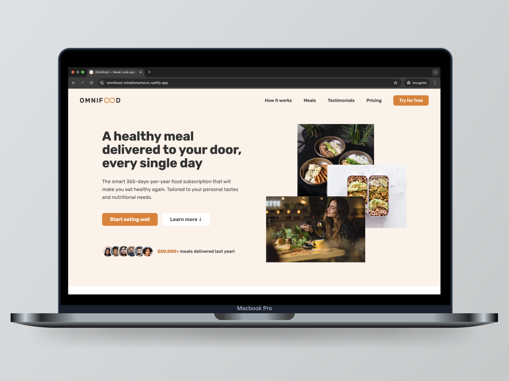

# [Omnifood Website Project 🚀](https://omnifood-mihailomarkovic.netlify.app/)

## Introduction

Welcome to the Omnifood Website Repository, a project that showcases my ability to create modern, responsive, and user-focused web experiences. This landing page is designed to highlight the features and vision of Omnifood, a fictional AI-driven meal planning and delivery service. Through this project, I honed my skills in HTML, CSS, and JavaScript, and applied best practices in responsive web design and clean code organization.

This project serves as a testament to my dedication to learning and applying real-world development techniques, and it reflects my ability to create websites that are both visually appealing and functional.

## Project Highlights

- **Built from Scratch:** Every line of code, from the structure to the styling, was written by hand, showcasing my understanding of fundamental web development concepts.
- **Responsive Design:** Designed to provide an optimal viewing experience on any device, from desktops to smartphones.
- **Modern UI/UX Principles:** Focused on creating an intuitive and user-friendly interface that aligns with contemporary design trends.
- **Practical JavaScript:** Added interactivity and functionality through JavaScript, ensuring an engaging user experience.

## What I Learned

This project allowed me to gain hands-on experience in several key areas:

1. HTML

- Semantic markup for improved accessibility and SEO.
- Structuring content logically and efficiently.

2. CSS

- Flexbox and Grid for layout design.
- Media queries to create a responsive layout for all screen sizes.
- Using custom properties (CSS variables) to maintain consistency in design.

3. JavaScript

- Adding basic interactivity to enhance the user experience.
- Writing clean and modular code for maintainability.

4. Design Principles

- Choosing harmonious color schemes and typography.
- Structuring content to maximize readability and engagement.
- Focusing on user-centric design.

5. Problem-Solving

- Debugging layout and responsiveness issues.
- Iteratively improving design and functionality based on feedback.

## Project Features

The Omnifood website is designed to highlight key features that make the service unique and appealing to users. At its core, the site emphasizes user-centric design, with a clear and engaging layout that captures attention and communicates value effectively. The hero section introduces visitors to the service with a compelling headline and summary, while a step-by-step guide provides a simple explanation of how the service works, making it easy for users to understand and navigate.

To ensure accessibility and inclusivity, the site is fully responsive, adapting seamlessly to different screen sizes and devices. This mobile-first approach guarantees a smooth browsing experience, whether on a desktop, tablet, or smartphone. Additionally, interactive elements powered by JavaScript enhance the user experience, adding functionality and encouraging engagement.

From showcasing diverse diets and sample meals to presenting transparent pricing plans, every section of the site is crafted to inform and inspire potential customers. Together, these features reflect a thoughtful approach to web design, combining aesthetics with functionality to create a polished and professional online presence.

## Technologies Used

- HTML5: For semantic and accessible markup.
- CSS3: For styling, layout, and animations.
- JavaScript: To add basic interactivity.

## Closing Thoughts

The Omnifood Website demonstrates my passion for web development and my ability to create modern, responsive, and user-friendly digital experiences. It reflects the foundational skills I've gained in HTML, CSS, and JavaScript, and my commitment to applying these skills in meaningful ways.

Thank you for taking the time to visit this repository, please feel free to explore the code and visit the site.
